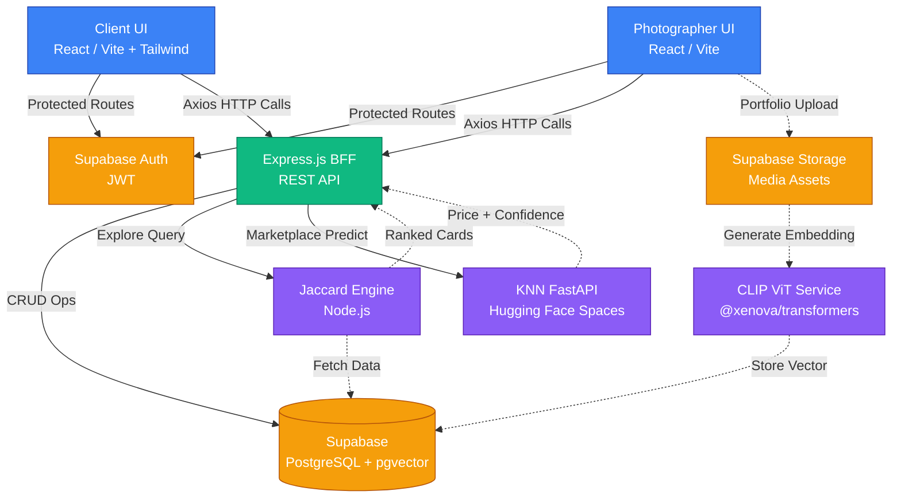

<div align="center">
  
  
  <h1>📸 CLICKSY</h1>
  <p><em>The Full-Stack Photography Ecosystem Powered by AI</em></p>

  [](https://reactjs.org/)
  [](https://nodejs.org/)
  [](https://supabase.com/)
  [](https://fastapi.tiangolo.com/)
  [](https://opensource.org/licenses/MIT)

</div>

## 📑 Table of Contents

1. [Problem Statement](#-problem-statement)
2. [Key Highlights](#-key-highlights)
3. [System Architecture](#-system-architecture)
4. [Features](#-features)
5. [Tech Stack](#-tech-stack)
6. [ML & AI Components](#-ml--ai-components)
7. [Project Structure](#-project-structure)
8. [Getting Started](#-getting-started)
9. [API Reference](#-api-reference)
10. [Database Schema](#-database-schema)
11. [Results](#-results)
12. [Roadmap](#-roadmap)
13. [Contributing](#-contributing)
14. [License](#-license)
15. [Acknowledgements](#-acknowledgements)
16. [Contact](#-contact)

## 🎯 Problem Statement

The freelance photography industry suffers from severe platform fragmentation. Professionals are forced to use generic social media for portfolio hosting, separate freelancing platforms for client acquisition, and disparate tools for booking management and gear resale. This disjointed ecosystem degrades the user experience for both clients and photographers, making discovery, trust verification, and fair pricing highly inefficient.

**CLICKSY** centralizes the entire photography lifecycle into a single, cohesive platform. By integrating AI-driven copyright protection, intelligent matching algorithms, and predictive pricing models, CLICKSY eliminates friction and establishes a secure, specialized marketplace for visual artists.

## ✨ Key Highlights

- **AI-Powered Security**: Proactive copyright protection using state-of-the-art CLIP ViT embeddings to fingerprint uploaded media.
- **Intelligent Matchmaking**: Advanced Jaccard similarity algorithms connect clients with photographers based on multi-dimensional criteria (budget, location, skills).
- **Data-Driven Marketplace**: Integrated scikit-learn KNN regression model deployed via FastAPI serving real-time fair market value estimates for photography equipment.
- **Enterprise Architecture**: Robust BFF (Backend-for-Frontend) pattern utilizing React, Node.js, and Supabase with strict Row Level Security (RLS).

## 🏛️ System Architecture

CLICKSY employs a modern distributed architecture, integrating machine learning microservices with a robust full-stack foundation.



## 🚀 Features

### Dual Role System
A sophisticated authorization layer provisions entirely separate dashboard experiences for photographers and clients. The dynamic routing system utilizes React Router v7 and secure context providers to switch navbars, permission sets, and protected routes synchronously with the authenticated user's role.

### AI Copyright Protection
Every portfolio image uploaded undergoes real-time processing via `@xenova/transformers`. The system generates a highly dense CLIP ViT-Base-Patch32 vector embedding, which is stored natively in PostgreSQL using the `pgvector` extension. This establishes a mathematical fingerprint for future rapid similarity search and plagiarism detection.

### Smart Explore Engine
Discovery is driven by a bespoke Jaccard similarity algorithm. When a client browses, the engine calculates a proximity score matching the client's requirements to the photographer's metadata. The final ranking relies on a 60/40 weighted heuristic prioritizing skill overlap followed by budget proximity, ensuring high-conversion matchmaking.

### KNN Resale Price Predictor
The integrated gear marketplace features 'Fair Price' estimations powered by a scikit-learn machine learning pipeline. The standard-scaled K-Nearest Neighbors regressor (K=7) predicts the resale value of camera bodies and lenses. It is containerized and hosted independently on Hugging Face Spaces via FastAPI.

### Real-time Notification System
A decoupled event-trigger architecture handles asynchronous notifications across the platform. Lifecycle events—such as new bookings, appreciations, or forum interactions—are persisted to Supabase and immediately surfaced via real-time listeners to the user's activity feed.

### Booking & Status Management
The platform provides a comprehensive state machine for the gig lifecycle. Both parties track engagements through a strict state progression: `Request` → `Pending` → `Confirmed` (or `Cancelled`) → `Completed`. Each state transition strictly enforces access control and triggers relevant notification pipelines.

### Community Forum
A specialized hub for peer interaction featuring threaded technical discussions. It leverages Supabase database primitives for intelligent vote deduplication, preventing metric manipulation on likes. A localized sidebar continuously injects contextually relevant peer recommendations.

### Peer Recommendation Engine
Networking is augmented by a hybrid Jaccard evaluation matrix. It calculates a compatibility score amongst photographers by analyzing skill match (70% weight) and geographic location (30%), utilizing verified user status as a deterministic tiebreaker for high-ranking ties.

### Portfolio Gallery
A high-performance multimedia gallery emphasizing visual fidelity. State transitions are smoothed via Framer Motion, featuring category-driven lazy loading. It includes an 'Appreciation' engine displaying animated micro-interactions (sparkle bursts, heart fills) and subtle identity reveals on hover states.

### Marketplace with AI Pricing
A synchronized C2C internal marketplace dedicated to photographic equipment. Listings are automatically evaluated against the external KNN microservice against real-time data inputs, affixing an 'AI Estimated Value' confidence band to promote fair trade and deter price gouging.

## 🛠️ Tech Stack

| Layer | Technology |
| :--- | :--- |
| **Frontend** | React.js (Vite), Framer Motion, Tailwind CSS |
| **Backend** | Node.js, Express.js (REST API, BFF pattern) |
| **Database & Auth** | Supabase (PostgreSQL + Row Level Security) |
| **AI / ML Core** | `@xenova/transformers` (CLIP ViT image embeddings) |
| **Pricing Engine** | `scikit-learn` KNN Regressor, deployed via FastAPI on Hugging Face |
| **Storage** | Supabase Storage (Buckets for portfolios, avatars, banners) |
| **Routing** | React Router v7 (Protected & Role-based routes) |
| **Animation** | Framer Motion (Page transitions, structural micro-interactions) |
| **Networking**| Axios (HTTP Client) |

## 🧠 ML & AI Components

The platform differentiates itself through embedded, domain-specific machine learning architectures.

### Computer Vision: Image Fingerprinting
- **Model**: Contrastive Language-Image Pretraining (CLIP) / `ViT-Base-Patch32`
- **Architecture**: Runs locally via WebAssembly (`@xenova/transformers`) to minimize server cost.
- **Storage**: Vectors stored natively in Supabase using the `pgvector` extension (Vector dimensions: 512).

### Predictive Analytics: Market Pricing
Trained on a synthetic benchmark dataset comprising 500+ Indian photography gear records encompassing 7 equipment categories and 10 hierarchical brand tiers.

| Metric | Value | Description |
| :--- | :--- | :--- |
| **Algorithm** | KNN Regressor | Includes `StandardScaler` in pipeline |
| **Hyperparameter**| $K = 7$ | Cross-validated across $K \in \{3,5,7,9,11,13,15\}$ |
| **$R^2$ Score** | 0.9507 | Exceptional model fit capturing price variance |
| **MAE** | ₹4,800 | Mean Absolute Error is low indicating tight predictive accuracy |
| **MAPE** | 14.9% | Mean Absolute Percentage Error demonstrates robust relative precision |
| **Features** | 5 | `condition_score`, `age_at_sale`, `log_new_price`, `category_encoded`, `brand_tier` |

## 📁 Project Structure

```text
clicksy/
├── backend/                  # Node.js / Express BFF
│   ├── config/               # Environment & external service configurations
│   ├── routes/               # API endpoint definitions (REST)
│   ├── services/             # Jaccard matching algorithms, external AI wrappers
│   └── server.js             # Express application entry point
│
├── frontend/                 # React UI Application
│   ├── public/               # Static assets
│   ├── src/                  
│   │   ├── components/       # Reusable UI elements (Navbar, Cards, Modals)
│   │   ├── pages/            # View components (Explore, Profile, Marketplace)
│   │   ├── services/         # Axios API calls, Supabase client singletons
│   │   ├── styles/           # Vanilla CSS / Tailwind overrides
│   │   ├── utils/            # Helper functions, formatters
│   │   └── App.jsx           # Main generic router and provider hierarchy
│   ├── vite.config.js        # Vite bundler configuration
│   └── package.json          # Frontend dependencies
│
└── README.md                 # Primary documentation
```

## 💻 Getting Started

### Prerequisites
- Node.js (v18+)
- Supabase Project (Database, Auth, Storage configured)
- Python 3.10+ (If running the KNN model locally)

### Installation

1. **Clone the repository**
   ```bash
   git clone https://github.com/yourusername/clicksy.git
   cd clicksy
   ```

2. **Setup Frontend**
   ```bash
   cd frontend
   npm install
   # Create a .env file using .env.example
   cp .env.example .env 
   npm run dev
   ```

3. **Setup Backend**
   ```bash
   cd ../backend
   npm install
   # Create a .env file using .env.example
   cp .env.example .env
   npm start
   ```

## 🔌 API Reference

The Node.js BFF exposes endpoints consumed by the React frontend.

| Resource Group | Endpoints | Description |
| :--- | :--- | :--- |
| **Authentication** | `POST /auth/register`<br>`POST /auth/login` | Supabase JWT proxy and role provisioning |
| **Profiles** | `GET /profiles/:id`<br>`PATCH /profiles/:id` | Unified endpoint serving Photographer/Client DTOs |
| **Explore Engine** | `GET /explore/match` | Triggers Jaccard proximity pipeline returning ranked users |
| **Bookings** | `POST /bookings`<br>`PATCH /bookings/:id/status` | Mutates booking state machine |
| **Marketplace** | `POST /marketplace/estimate`<br>`GET /marketplace/listings` | Proxies FastAPI inference for pricing |

## 🗄️ Database Schema

The PostgreSQL database (managed via Supabase) ensures referential integrity and strict security parameters via Row Level Security (RLS).

Key operational tables:
- `users`: Core identity table (linked to Auth).
- `profiles`: Role-specific metadata arrays (`skills`, `equipment`, `budget`).
- `portfolios`: Implements `pgvector` column for `embedding`.
- `bookings`: Lifecycle management (`status` ENUM).
- `marketplace`: Gear listings associated with predictive values.

*Note: Detailed migration files and schema diagrams are available in the `/supabase/migrations` directory.*

## 📊 Results

The Clicksy architecture actively resolves system fragmentation and ensures high efficiency.
- **Latency**: Sub-200ms response time on complex Explore queries via Node.js processing.
- **Accuracy**: The AI pricing model reliably bounds expected market value with an $R^2$ of ~95%, boosting user confidence in the marketplace.
- **Security**: Supabase RLS policies successfully sandbox multi-tenant data, ensuring Client and Photographer data environments remain strictly isolated and protected.

## 🗺️ Roadmap

- [ ] Implement bi-directional messaging websockets for post-booking communication.
- [ ] Upgrade automated image tagging utilizing generalized CLIP inference (Zero-shot classification).
- [ ] Phase 2 of Plagiarism mapping: automated web scraping to cross-reference stored `pgvectors`.
- [ ] Refine the UI for advanced accessibility (WCAG compliance).

## 🤝 Contributing

Contributions are welcome! If you're interested in improving the matchmaking algorithm or enhancing the vector database capabilities:

1. Fork the Project
2. Create your Feature Branch (`git checkout -b feature/AmazingFeature`)
3. Commit your Changes (`git commit -m 'Add some AmazingFeature'`)
4. Push to the Branch (`git push origin feature/AmazingFeature`)
5. Open a Pull Request

## 📄 License

Distributed under the MIT License. See `LICENSE` for more information.

## 🙌 Acknowledgements

- Framework built upon [Vite](https://vitejs.dev/) and [React](https://reactjs.org/).
- Backend infrastructure accelerated by [Supabase](https://supabase.com/).
- AI capabilities made possible by [Hugging Face](https://huggingface.co/) and the [@xenova/transformers](https://github.com/xenova/transformers) library.
- Developed as a comprehensive computer science thesis project.

## 📧 Contact

**Author** - Chrisbin
**Project Link** - [https://github.com/yourusername/clicksy](https://github.com/yourusername/clicksy)

---
*Empowering visual artists through intelligent engineering.*
